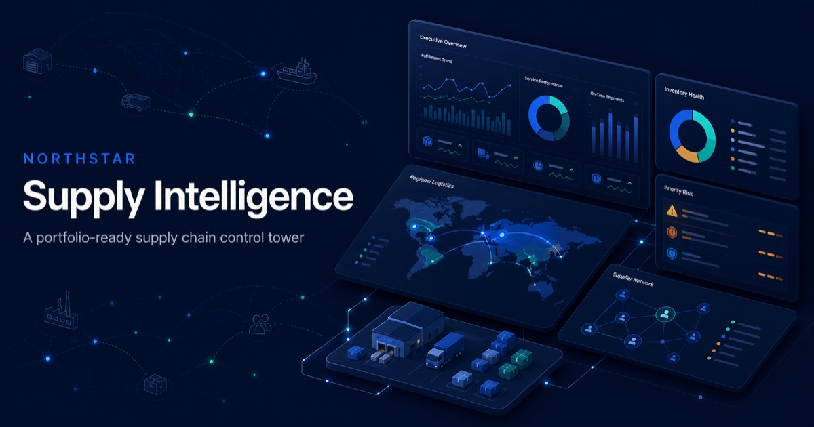

# Northstar Supply Intelligence — reusable BI template



A polished, open-source supply-chain dashboard that anyone can reuse by replacing five CSV files. No KPI numbers, regions, product families or detail rows are hardcoded in the interface.

## Use this template

1. Copy the blank CSVs from [`templates/`](templates/).
2. Fill them with your ERP, WMS, TMS, supplier and exception data.
3. Replace the matching files in [`public/data/`](public/data/).
4. Set your company name and KPI targets in [`public/config/dashboard.json`](public/config/dashboard.json).
5. Run the data check and open the dashboard.

```bash
npm install
npm run validate:data
npm run dev
```

That is enough to refresh all four workspaces, 16 KPIs, filters, trends, drill-down tables and exports.

## Included workspaces

| Workspace | Decisions supported | Primary data |
| --- | --- | --- |
| Control tower | Service, cost, cash and exceptions | Orders + all sources |
| Inventory | Turns, DOH, excess and stockout action | Inventory snapshots |
| Suppliers | OTIF, quality, PPV and risk | Supplier receipts |
| Logistics | Freight, arrival, modes and lanes | Shipments |

## What recalculates automatically

- Region and product-family filter options
- Perfect order rate, on-time delivery and orders at risk
- Inventory value, turns, excess, stockout rate and days on hand
- Supplier OTIF, quality PPM, high-risk suppliers and price variance
- Freight spend, on-time arrival, cost per shipment and delays
- Regional, SKU, supplier and lane scorecards
- Inventory health and freight mode mix
- Exception counts and exported management views

## Documentation

- [Five-minute setup](docs/QUICKSTART.md)
- [Complete data dictionary](docs/DATA_DICTIONARY.md)
- [ERP / WMS / TMS field mapping](docs/FIELD_MAPPING.md)

## Quality checks

`npm run validate:data` checks that every required file, header and configuration exists. GitHub Actions repeats the data check, lint and production build on every push and pull request.

## Data and privacy

The included records are fictional demonstration data. Replace them with anonymized or aggregated records before publishing if your source data is confidential.

## License

MIT — use it for portfolios, internal analytics prototypes, teaching or your own open-source template.
